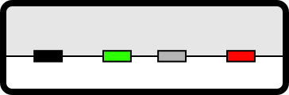
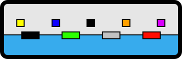
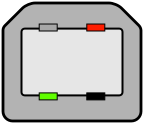
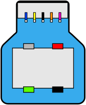
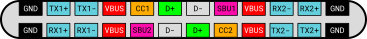

# USB Cheat Sheet
Sources: https://fabiensanglard.net/usbcheat/index.html

| Marketing Name | Also Known As | Signal Gbps | Signal MiB/s | Wires | Cable |
| --- | --- | --- | --- | --- | --- |
| USB 1.1 | Full Speed | 12 Mbps | 1.5 MiB/s | 4   | 4m  |
| USB 2.0 | Hi-Speed | 480 Mbps | 60 MiB/s | 4   | 4m  |
| SuperSpeed USB  5Gbps | USB 3.0   USB 3.1   USB 3.2   USB 3.1 Gen 1   USB 3.2 Gen 1 | 5000 Mbps | 625 MiB/s | 8   | 3m  |
| SuperSpeedPlus USB 10Gbps | USB 3.1   USB 3.2   USB 3.1 Gen 2   USB 3.2 Gen 2 | 10000 Mbps | 1250 MiB/s | 8   | 2m  |
| SuperSpeedPlus USB 20Gbps | USB 3.2   USB 3.2 Gen 2x2 | 20000 Mbps | 2500 MiB/s | 12  | 1m  |
| USB4 20Gbps | USB4 Gen 2×2   USB4 | 20000 Mbps | 2500 MiB/s | 12  | 0.8m |
| USB4 40Gbps | USB4 Gen 3×2   USB4 | 40000 Mbps | 5000 MiB/s | 12  | 0.8m |

## Gen naming Convention, lanes, and Speed:

USB Gen A x B  
A = Generation  
B = Num lanes used  

| Name | Signal | Sig Totala | Encoding | Effective bb | Effective Bb | Real Lifec |
| --- | --- | --- | --- | --- | --- | --- |
| USB 3.2 Gen 1x1 | 5,000 Mbps | 5,000 Mbps | 8b/10b | 4,000 Mbps | 500 MiB/s | 400 MiB/s[\[1\]](#footnote_1) |
| USB 3.2 Gen 1x2 | 5,000 Mbps | 10,000 Mbps | 8b/10b | 8,000 Mbps | 1,000 MiB/s | 800 MiB/s |
| USB 3.2 Gen 2x1 | 10,000 Mbps | 10,000 Mbps | 128b/132b | 9,696 Mbps | 1,212 MiB/s | 780 MiB/s[\[2\]](#footnote_2) |
| USB 3.2 Gen 2x2 | 10,000 Mbps | 20,000 Mbps | 128b/132b | 19,392 Mbps | 2,424 MiB/s | 1,600 MiB/s[\[4\]](#footnote_4) |
| USB 4 Gen 2x2 | 10,000 Mbps | 20,000 Mbps | 128b/132b | 19,392 Mbps | 2,424 MiB/s | 1,600 MiB/s |
| USB 4 Gen 3x2 | 20,000 Mbps | 40,000 Mbps | 128b/132b | 38,787 Mbps | 4,848 MiB/s | 2,700 MiB/s[\[5\]](#footnote_5) |

**Note:** Multi-lanes systems, uses lane striping (on TX) and lane bonding (on RX).  
a - What they put on the box.  
b - Rate with encoding overhead. e.g, 8b/10b = 20%.  
c - Real life sequencial read rate.  

## Cables

4 wires: PWR, GND, D+, D-.  
 8 wires: PWR, GND, D+, D-. RX+ , RX- , TX- , TX+.  
12 wires: PWR, GND, D+, D-, RX1+, RX1-, RX2-, RX2+, TX1+, TX1-, TX2-, TX2+.

**Note:** 1 USB lane = 1 twisted wire pair +/-.  
**Note:** 4 wires = 1 half-duplex lane, 8 wires = 2 lanes (one up, one down), and 12 wires = 4 lanes (two up, two down).

### USB-A/B: Connectors 4/8 wires

| Type-A 4-wires | Type-A 8-wires | Type-B 4-wires | Type-B 8-wires |
| --- | --- | --- | --- |
|  |  |  |  |

### USB-C: Connectors 12 wires

Only the USB Type-C connector has enough pins to support two lanes.

\- CC1 and CC2 are downstream facing port (DFP) and upstream facing port (UFP) detection. Also used for power negotiation and alt mode switch.  
\- SBU1 and SBU2 are secondary bus wires, for the DisplayPort AUX channel and hot plug detection (HPD).

### Charge rates / Cable types

| Specifications | Max. Voltage | Max. Current | Max. Power |
| :---: | :---: | :---: | :---: |
| USB 2.0 | 5V  | 500mA | 2.5W |
| USB 3.0 / USB3.1 | 5V  | 900mA | 4.5W |
| USB Battery Charging (BC) 1.2 | 5V  | 1.5A | 7.5W |
| USB-C Current Mode (non-PD) | 5V  | 3A  | 15W |
| USB-C / Power Delivery (PD 1/2) | 20V | 5A  | 100W |
| USB-C PD 3.1 (EPR) | 48V | 5A  | 240W |

## Specifications

[USB 1.0](https://fabiensanglard.net/usbcheat/usb1.pdf) (Jan, 1996).  
[USB 1.1](https://fabiensanglard.net/usbcheat/usb1.1.pdf) (Sep, 1998).  
[USB 2.0](https://fabiensanglard.net/usbcheat/usb2.pdf) (Apr, 2000).  
[USB 3.0](https://fabiensanglard.net/usbcheat/usb3.pdf) (Nov, 2008).  
[USB 3.1](https://fabiensanglard.net/usbcheat/usb3.1.pdf) (Jul, 2013).  
[USB 3.2](https://fabiensanglard.net/usbcheat/usb3.2.pdf) (Sep, 2017).  
[USB 4.0](https://fabiensanglard.net/usbcheat/usb4.pdf) (Aug, 2019).  

## References

|     |     |     |
| --- | --- | :--- |
| [^](#back_1) | \[1\] | [Universal Serial Bus Revision 3.0 Specification](https://fabiensanglard.net/usbcheat/usb2.pdf) |
| [^](#back_2) | \[2\] | [Real-world USB 3.2 Gen 2 Performance](https://www.everythingusb.com/speed.html) |
| [^](#back_3) | \[3\] | [USB 3.1 Tested: Performance](https://www.tomshardware.com/reviews/usb-3.1-performance-benchmark,4037-2.html) |
| [^](#back_4) | \[4\] | [World’s First USB 3.2 Demonstration \| Synopsys](https://www.youtube.com/watch?v=WPUvHeq_Sgs) |
| [^](#back_5) | \[5\] | [USB4.0 M.2 NVMe Enclosure Review](https://thepcenthusiast.com/yottamaster-usb4-0-m-2-nvme-enclosure-review/) |
